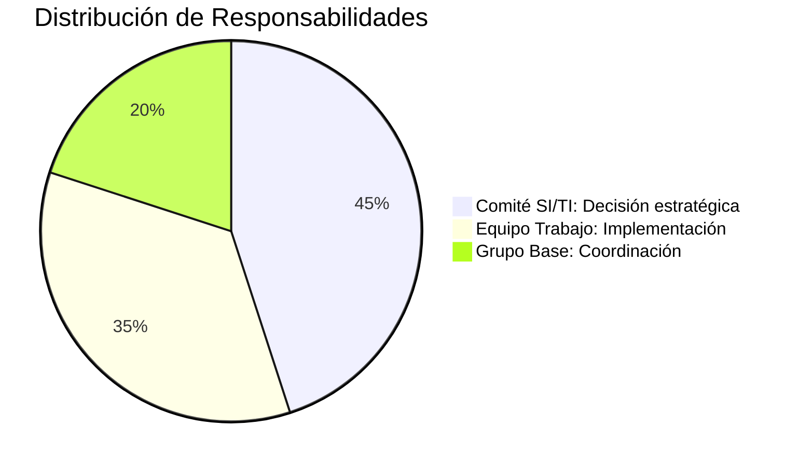

# 🌐 **Alineación Estratégica SI-TI con la Organización**

## 🔄 **Proceso Completo de Alineación**

1. **Matriz Inicial**  
   - Estrategias Organizacionales  
   - Departamentos/Áreas funcionales  

2. **Identificación**  
   - Necesidades de Información por área  
   - Objetivos estratégicos específicos  

3. **Integración**  
   - Consolidación de necesidades (priorizadas y no priorizadas)  
   - Derivación a Estrategias SI/TI  

4. **Planificación**  
   - Desarrollo del Plan de SI/TI  
   - Inclusión de:  
     - Proyectos de aplicaciones  
     - Requerimientos de HW/SW  

5. **Validación**  
   - Aval del Comité de SI/TI  
   - Traducción a Plan Informático ejecutable  

> 📌 **Responsabilidad compartida**:  
> - Dirección de la empresa (liderazgo)  
> - Estamento técnico (implementación)  

---

## 📋 **Esquema General del Procedimiento**

**Enfoque práctico**:  
Estas actividades representan **qué hacer** para elaborar el plan, no **cómo hacerlo**.

---

## 👥 **Estructura Organizacional para la Planificación**

### 🏛️ **Grupos de Trabajo Clave**

| **Componente**       | **Integrantes**                                                                 | **Responsabilidades Clave**                                                                 |
|-----------------------|--------------------------------------------------------------------------------|--------------------------------------------------------------------------------------------|
| **Comité SI/TI**      | - Máximas autoridades - Subdirectores áreas funcionales - Director SI/TI | - Supervisión global - Priorización estratégica - Aprobación final del Plan          |
| **Equipo de Trabajo** | - Director SI/TI - Personal técnico - Usuarios clave                    | - Desarrollo operativo del Plan - Análisis técnico de requerimientos                   |
| **Grupo Base**        | - Subdirector SI - Director SI/TI - DOP - Consultores externos       | - Coordinación interáreas - Garantía de consistencia técnica - Supervisión de calidad |

---

## 💼 **Detalles de Cada Grupo**

### 1. **Comité SI/TI**  
- **Máxima autoridad** en el diseño del SI  
- **Composición**:  
  - CEO/Gerencia General  
  - Gerencias Medias (incluyendo Gerencia de Sistemas)  
  - Director y Subdirector de SI/TI  
- **Funciones específicas**:  
  - Validación del proceso de planificación  
  - Establecimiento de compromisos organizacionales  
  - Definición de criterios para priorización  
  - Aprobación formal del Plan final  

### 2. **Equipo de Trabajo**  
- **Estructura operativa**:  
  - Liderado por Director SI/TI  
  - Personal especializado de sistemas  
  - Representantes de áreas usuarias  
  - Directores Operativos de Proyecto (DOPs) según complejidad  
  - Supervisores de áreas conflictivas (según necesidad)  
- **Alcance**:  
  - Elaboración técnica del Plan  
  - Documentación detallada  
  - Propuestas de solución  

### 3. **Grupo Base**  
- **Roles clave**:  
  - Facilitación de negociaciones técnicas  
  - Puente entre áreas usuarias y técnicas  
  - Control de calidad de entregables  
  - Mediación en conflictos  
- **Composición flexible**:  
  - Puede incluir consultores externos para necesidades específicas  

---

## 📌 **Consideraciones Clave**

> [!NOTE]  
> El Plan de SI/TI debe ser:  
> - **Integral**: Cubrir horizontes de 3-5 años  
> - **Detallado**: Especificar recursos para el primer año  
> - **Controlable**: Incluir mecanismos de evaluación  
> - **Oportuno**: Identificar áreas de mejora con TI  

**Perspectiva fundamental**:  
El enfoque principal es **de negocio**, no tecnológico. La tecnología es habilitadora, no el objetivo final.

---

## 🛠️ **Elementos Visuales Adicionales**

