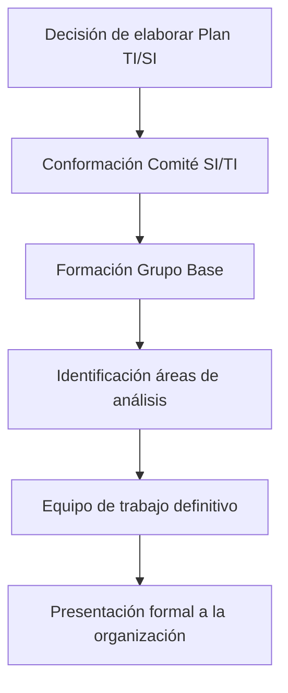

# 🌟 Fase 1 - Presentación y Compromiso del Equipo

## 🔄 Proceso Detallado de Implementación

### 📌 Pasos Específicos

1. **Decisión inicial y constitución del Comité SI/TI**
   - Resolución formal de la alta dirección
   - Designación de miembros clave:
     - Máximas autoridades
     - Directores funcionales
     - Responsable de SI/TI

2. **Formación del Grupo Base**
   - Composición inicial:
     - Subdirector de SI
     - Director de TI
     - DOP (Director Operativo de Proyecto)
     - Consultores externos (según necesidad)
   - Funciones primarias:
     - Establecer marco inicial de trabajo
     - Identificar stakeholders clave

3. **Mapeo de Áreas de Análisis**
   - Diagnóstico del SI existente:
     - Infraestructura actual
     - Aplicaciones en uso
     - Procesos soportados
     - Brechas identificadas

4. **Constitución del Equipo Definitivo**
   - Integrantes permanentes:
     - Especialistas técnicos
     - Representantes de áreas usuarias
     - Responsables de procesos clave
   - Presentación formal:
     - Objetivos del plan
     - Metodología de trabajo
     - Expectativas de participación

## 🎯 Objetivos Clave de la Fase

> [!IMPORTANT]  
> **Propósito fundamental**:  
> Establecer las bases organizacionales y el compromiso institucional  
> para el desarrollo exitoso del Plan de TI/SI

- Garantizar el **apoyo explícito** de la alta dirección
- Definir la **estructura de gobernanza** del proyecto
- Establecer los **mecanismos de participación** transversal
- Comunicar formalmente el **alcance y importancia** de la iniciativa

## 👥 Responsabilidades Asignadas

| **Grupo**         | **Responsabilidades Primarias**                                                                 |
|--------------------|------------------------------------------------------------------------------------------------|
| **Comité SI/TI**   | - Tomar la decisión inicial - Aprobar la estructura de trabajo - Brindar respaldo político |
| **Grupo Base**     | - Diseñar el enfoque metodológico - Seleccionar al equipo técnico - Preparar presentaciones |

## 💡 Consideraciones Críticas

> [!WARNING]  
> **Factores de éxito**:  
> - El compromiso debe ser **explícito y público**  
> - Los recursos (tiempo/personas) deben estar **garantizados**  
> - La comunicación debe ser **clara y transversal**

**Requisito fundamental**:  
La decisión debe originarse en el **más alto nivel directivo** y contar con el compromiso activo de todos los subdirectores generales, quienes deben:

1. Comprender la **necesidad estratégica** del plan  
2. Aceptar la **asignación de recursos** requeridos  
3. Comprometerse con el **proceso de implementación**

## 📋 Checklist de Implementación

- [ ] Decisión formal documentada  
- [ ] Designación de comité y grupo base  
- [ ] Identificación de áreas críticas a analizar  
- [ ] Selección de equipo técnico definitivo  
- [ ] Presentación institucional realizada  
- [ ] Compromisos de recursos establecidos  
