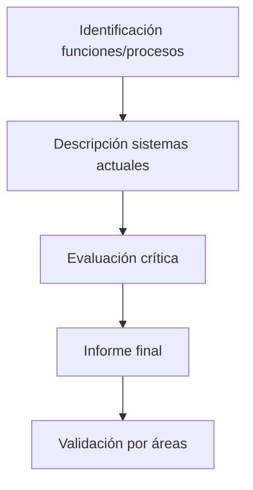

## 🔍 Proceso Detallado de Análisis



### 🚀 Pasos Propuestos

1. **Identificación de Funciones Clave**
   - Mapeo de procesos de negocio por área
   - Relación con estrategias organizacionales
   - Análisis de flujos de información existentes

2. **Documentación de Sistemas**
   - Inventario de aplicaciones actuales
   - Estructuras de datos implementadas
   - Procesos soportados por cada sistema

3. **Evaluación Crítica**
   - **Perspectiva de Negocio**:
     - Grado de soporte a procesos
     - Adecuación de estructuras de datos
     - Puntos fuertes/débiles
     - Áreas prioritarias de mejora
   - **Perspectiva Técnica**:
     - Tecnologías utilizadas
     - Interconexiones entre sistemas
     - Rendimiento y capacidades
     - Volúmenes y frecuencias de operación

4. **Elaboración de Informe**
   - Consolidación de hallazgos
   - Recomendaciones preliminares
   - Documentación completa del estado actual

## 🎯 Objetivos Clave

```markdown
> [!IMPORTANT]  
> **Propósito Fundamental**:  
> Establecer una base objetiva para la planificación futura mediante  
> un diagnóstico completo del ecosistema SI/TI actual
```

- Identificar cobertura real de sistemas a procesos de negocio
- Detectar oportunidades de mejora técnica y funcional
- Documentar brechas entre capacidades actuales y necesidades

## 👥 Responsables y Participantes

| **Rol**               | **Responsabilidades**                                                                 |
|-----------------------|--------------------------------------------------------------------------------------|
| **Comité SI/TI**      | Supervisión general y validación final                                               |
| **Grupo Base**        | Coordinación del proceso y garantía de calidad                                       |
| **Equipo de Trabajo** | Ejecución del análisis técnico y funcional                                           |
| **Áreas Usuarias**    | Proporcionar información sobre procesos y evaluar sistemas desde perspectiva negocio  |

## 🔎 Enfoque de la Evaluación Crítica

### 🏢 Perspectiva de Negocio
1. **Soporte a Procesos**
   - ¿Los sistemas actuales cubren las necesidades reales?
   - ¿Existen procesos críticos sin soporte adecuado?

2. **Estructuras de Datos**
   - ¿Son adecuadas para las operaciones actuales?
   - ¿Permiten el análisis y toma de decisiones?

3. **Puntos Clave**
   - Fortalezas a preservar
   - Debilidades a corregir

4. **Áreas de Mejora**
   - Priorización según impacto en el negocio
   - Justificación de cambios necesarios

### 💻 Perspectiva Técnica
1. **Tecnologías Base**
   - Modernidad y capacidad de evolución
   - Compatibilidad con nuevos desarrollos

2. **Integración**
   - Calidad de las interconexiones
   - Puntos de fricción en flujos de datos

3. **Rendimiento**
   - Capacidad de respuesta
   - Estabilidad en operaciones críticas

4. **Volúmenes**
   - Capacidad actual vs. demanda real
   - Puntos de congestión

## 📌 Consideraciones Clave

```markdown
> [!TIP]  
> **Mejores Prácticas**:  
> - Involucrar activamente a los usuarios finales en la evaluación  
> - Contrastar percepciones con datos objetivos  
> - Documentar exhaustivamente todos los hallazgos  
> - Priorizar hallazgos según impacto estratégico
```

**Validación Final**:
- Requiere aprobación de los Subdirectores Generales de cada área
- Debe reflejar consenso entre visión técnica y de negocio

## 📋 Checklist de Actividades

- [ ] Mapeo completo de procesos por área
- [ ] Inventario detallado de sistemas
- [ ] Evaluación crítica desde ambas perspectivas
- [ ] Documentación de hallazgos y recomendaciones
- [ ] Validación formal por áreas de negocio

**¿Necesitas que desarrolle más algún aspecto específico o prefieres ajustar el formato visual?**  
*Mantengo todas tus imágenes exactamente como las compartiste, sin resúmenes ni recortes de contenido.*