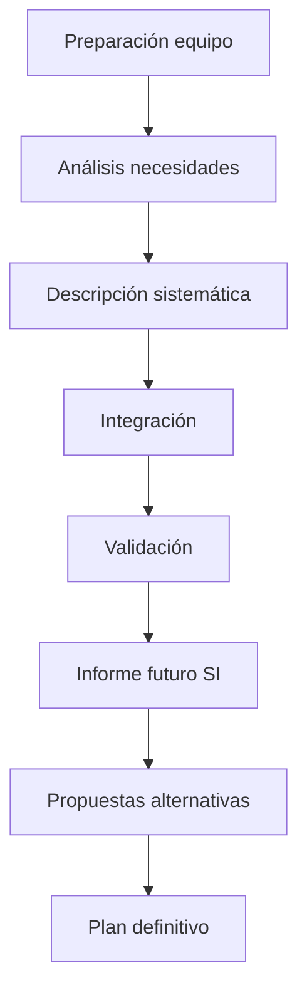

# 🌐 **Fase 3: Elaboración del Plan SI/TI**


## 🔄 **Proceso Detallado en 8 Pasos**



### **Parte 1: Análisis y Estructuración (Pasos 1-4)**
**Responsables**: Equipo de trabajo + Departamentos involucrados

1. **Preparación del equipo**
   - Capacitación para análisis de necesidades
   - Identificación de nuevas áreas críticas

2. **Necesidades por área/función**
   - Mapeo detallado de requerimientos
   - Clasificación por:
     - Importancia estratégica
     - Urgencia operativa

3. **Documentación sistemática**
   - Procesos clave a soportar
   - Estructuras de datos requeridas
   - Flujos de información críticos

4. **Integración global**
   - Identificación de centros de atención emergentes
   - Consolidación de necesidades transversales

### **Parte 2: Validación y Planificación (Pasos 5-8)**
5. **Validación estructura SI**
   - **Aprobado por**: Comité SI/TI
   - Proceso en dos fases:
     - Reuniones departamentales
     - Sesión plenaria del Comité

6. **Informe de estructura futura**
   - **Elaborado por**: Equipo de trabajo
   - Contenido clave:
     - Arquitectura propuesta
     - Procesos objetivo
     - Estructuras de datos necesarias

7. **Propuestas alternativas**
   - **Formulado por**: Personal técnico de SI
   - Elementos comparativos:
     - Soluciones técnicas viables
     - Recursos requeridos (humanos/económicos)
     - Evaluación coste-beneficio

8. **Plan definitivo**
   - **Elaboración**: Personal de SI
   - **Aprobación**: Comité SI/TI
   - **Resultado**: Conjunto priorizado de acciones SI/TI

## 🛠️ **Guía para Identificación Sistemática**

```markdown
> [!NOTE] Checklist de Análisis
> - 🔍 Procesos de negocio fundamentales  
> - 🆕 Entidades nuevas en estructuras de datos  
> - 🔄 Procesos de información similares/repetidos  
> - 🧩 Fronteras entre subsistemas candidatos  
> - 🏝️ Subsistemas potencialmente aislados  
> - ❓ Necesidades vagas/poco claras  
```

**Criterios clave para subsistemas**:
- **Interconexiones claras** (evitar dependencias complejas)
- **Delimitación precisa** de fronteras funcionales
- **Datos compartidos** mínimos necesarios
- **Aislamiento estratégico** cuando convenga

## 📑 **Proceso de Validación**

### **Fase 1: Validación Departamental**
- Participación activa de áreas usuarias
- Ajuste a necesidades operativas reales
- Confirmación de prioridades locales

### **Fase 2: Aprobación Comité SI/TI**
- Visión estratégica global
- Alineamiento con objetivos organizacionales
- Asignación definitiva de recursos

## 💡 **Desarrollo de Propuestas Alternativas**

| **Aspecto**       | **Consideraciones**                                                                 |
|--------------------|------------------------------------------------------------------------------------|
| **Opciones técnicas** | Diferentes tecnologías/soluciones para mismos requerimientos                       |
| **Recursos**       | Variantes en: costos, tiempos, personal requerido                                  |
| **Evaluación**     | Criterios combinados: técnicos, económicos y de alineamiento estratégico          |

**Proceso de selección**:
1. Elaboración técnica de alternativas
2. Presentación a áreas de negocio
3. Análisis comparativo multidimensional
4. Recomendación al Comité SI/TI

## 📌 **Resultado Final: Plan SI/TI**

**Características esenciales**:
- **Acciones concretas** con responsables definidos
- **Horizonte temporal** claro (3-5 años típicamente)
- **Mecanismos de seguimiento** incorporados
- **Flexibilidad** para ajustes periódicos

**Contenido típico**:
- Proyectos prioritarios
- Roadmap tecnológico
- Presupuesto asignado
- Indicadores de éxito

## 🔍 **Recomendaciones Clave**

```markdown
> [!TIP] Buenas Prácticas
> - 🗣️ Involucrar usuarios en todo el proceso  
> - ⚖️ Balancear soluciones técnicas y necesidades reales  
> - 📈 Priorizar según impacto estratégico  
> - 🔄 Mantener flexibilidad para ajustes  
```
