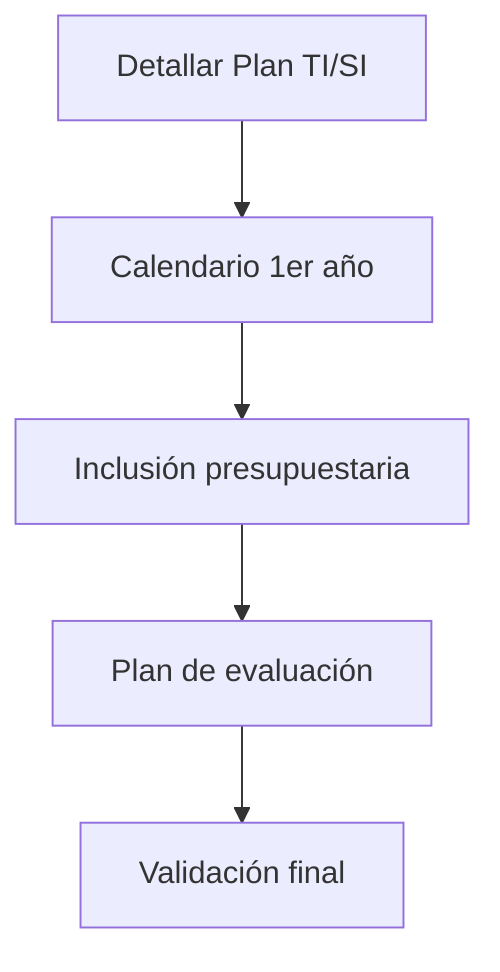

# 📅 Fase 4: Programación de Actividades


## 🔄 Proceso de Planificación Detallada



### 🛠️ Pasos Clave de Implementación

1. **Documentación Ejecutiva del Plan**
   - Especificación técnica completa de proyectos
   - Secuenciación lógica de actividades
   - Diagramas de Gantt detallados
   - Asignación preliminar de recursos

2. **Desarrollo del Calendario Operativo**
   - Cronograma mensual/trimestral para el primer año
   - Hitos críticos y entregables clave
   - Dependencias entre proyectos
   - Buffer para imprevistos

3. **Integración Presupuestaria**
   - Estimación de costos por proyecto
   - Asignación de partidas específicas
   - Alineación con ciclo presupuestario organizacional
   - Mecanismos para ajustes financieros

4. **Sistema de Evaluación Continua**
   - Indicadores de desempeño (KPIs)
   - Frecuencia de revisiones (trimestral/semestral)
   - Mecanismos de reporte
   - Proceso para ajustes estratégicos

## 👥 Responsabilidades Asignadas

| **Rol**                     | **Funciones Específicas**                                                                 |
|-----------------------------|------------------------------------------------------------------------------------------|
| **Director Operativo (DOP)** | - Elaboración lista de proyectos<br>- Estimación de recursos<br>- Diseño calendario base |
| **Director de SI**          | - Revisión técnica<br>- Priorización operativa<br>- Aprobación interna                  |
| **Subdirector General SI**  | - Validación estratégica<br>- Asignación global de recursos                             |
| **Comité SI/TI**            | - Aprobación final<br>- Vinculación con objetivos organizacionales                      |

## 📋 Componentes del Plan Ejecutivo

### 📅 Calendario Anual Detallado
- Proyectos prioritarios con fechas clave
- Asignación de equipos responsables
- Recursos críticos por periodo
- Entregables esperados

### 💰 Anexo Presupuestario
- Desglose por categorías:
  - Inversión en hardware/software
  - Costos de desarrollo
  - Gastos de capacitación
  - Contingencias (5-10%)

### 📊 Sistema de Monitoreo
```markdown
> [!NOTE] Elementos de Control
> - 🔴🟢🟡 Semáforo de avance por proyecto  
> - 📈 Métricas cuantitativas de progreso  
> - 📝 Reportes cualitativos de riesgos  
> - 🔄 Mecanismos de escalamiento  
```

## 🚦 Proceso de Validación

**Flujo de aprobaciones**:
1. Revisión técnica por equipo de SI
2. Validación operativa por dirección de SI
3. Aprobación estratégica por Comité

**Criterios de evaluación**:
- Viabilidad técnica
- Adecuación presupuestaria
- Alineamiento con objetivos
- Flexibilidad para adaptaciones

## 💡 Recomendaciones Clave

```markdown
> [!TIP] Mejores Prácticas
> - 🗓️ Incluir hitos intermedios cada 3-6 meses  
> - 💸 Reservar partida para imprevistos (10-15%)  
> - 👥 Designar responsables claros por proyecto  
> - 🔍 Establecer revisiones periódicas obligatorias  
```

**Documentación complementaria sugerida**:
- Matriz RACI por proyecto
- Plan de gestión de riesgos
- Protocolo para cambios de alcance

## 📌 Checklist Final

- [ ] Plan documentado en detalle
- [ ] Calendario aprobado por áreas
- [ ] Presupuesto incorporado
- [ ] Sistema de evaluación establecido
- [ ] Validación completa del Comité
