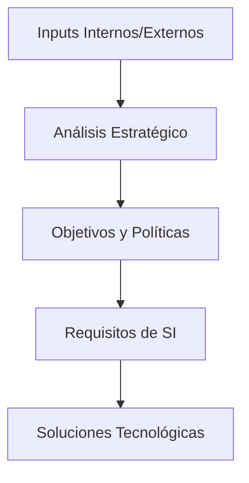

# 🎯 **Planificación de los SI/TI a partir de la Estrategia del Negocio**  

## **¿Qué es una Estrategia?**  
Conjunto de **acciones prioritarias** que guían a una organización hacia sus objetivos, asignando recursos para:  
- **Incrementar la prosperidad** a largo plazo.  
- **Fortalecer ventajas competitivas**.  

---

## 🌐 **El Contexto de la Estrategia de SI/TI**  
Los SI/TI son **facilitadores críticos** de la estrategia empresarial. Su integración requiere:  
1. **Análisis de *inputs* internos/externos** (necesidades, tecnología, competencia).  
2. **Traducción de requisitos** ("¿Qué hacer?") → **Soluciones tecnológicas** ("¿Cómo hacerlo?").  

  

> [!NOTE]  
> **Componentes clave**:  
> - **Estrategia de SI**: Necesidades de información y aplicaciones.  
> - **Estrategia de TI**: Tecnología y recursos para implementarlas.  

---

### 📌 **Estrategia de Sistemas de Información (SI)**  
Define:  
- **Necesidades de información** de la empresa (por área o corporativas).  
- **Aplicaciones futuras**, basadas en:  
  - Análisis del negocio.  
  - Entorno competitivo.  
  - Objetivos estratégicos.  

**Características**:  
- Dinámica (se actualiza continuamente).  
- Alineada con los **puntos críticos del negocio**.  

---

### 🖥️ **Estrategia de Tecnología de la Información (TI)**  
Responde: **¿Cómo satisfacer las necesidades del SI?**  
- **Desarrollo de aplicaciones** (métodos, herramientas).  
- **Gestión de recursos**:  
  - Tecnológicos (hardware, software).  
  - Humanos (equipos, habilidades).  
  - Organizativos (procesos, controles).  

**Enfoque dual**:

| **Demanda (SI)**                         | **Oferta (TI)**                        |     |
| ---------------------------------------- | -------------------------------------- | --- |
| "Necesito X aplicación para Y objetivo." | "Usaré Z tecnología para construir X." |     |

---

## 📅 **Planificación de la Estrategia SI/TI**  
Proceso **continuo e integrado** en la planificación empresarial.  

### 🔑 **Claves para el Éxito**  
- **Participación activa** de personal de negocio y TI.  
- **Hitos claros** con aprobación de la dirección.  
- **Información transparente** sobre:  
  - Objetivos.  
  - Metodología.  
  - Resultados esperados.  

---

### 📋 **Contenido de un Plan SI/TI**  
1. **Proyectos prioritarios** (3-5 años).  
2. **Diagnóstico inicial** (estado actual de SI/TI).  
3. **Detalles ejecutivos** para el primer año:  
   - Recursos necesarios.  
   - Presupuesto.  
4. **Mecanismos de control**:  
   - Calendarios.  
   - Evaluaciones periódicas.  
5. **Oportunidades de mejora**:  
   - Uso de TI para eficiencia/eficacia.  

> [!IMPORTANT]  
> **Perspectiva empresarial** (no tecnológica): El plan debe enfocarse en **cómo los SI/TI generan valor**, no en especificaciones técnicas.  

  

---

## 🔍 **Inputs para la Estrategia SI/TI**  

### 1. **Entorno Externo**  
- **Tendencias tecnológicas**: Oportunidades y riesgos.  
- **Benchmarking**: Uso de SI/TI en la industria y otros sectores.  

### 2. **Entorno Interno**  
- **Misión y objetivos** del negocio.  
- **Procesos clave** (operativos, de control).  
- **Fortalezas/debilidades** organizacionales.  
- **Estructura y cultura** (toma de decisiones).  

### 3. **Recursos Actuales de SI/TI**  
- **Auditoría de aplicaciones** (qué funciona y qué no).  
- **Capacidades del equipo** (habilidades, métodos de desarrollo).  

---

### 💡 **Consejos Prácticos**  
- **Evitar "soluciones en busca de problemas"**: La tecnología debe responder a necesidades reales.  
- **Flexibilidad**: Adaptar el plan a cambios en el negocio.  
- **Comunicación constante** entre áreas de negocio y TI.  

# 🚀 Planificación de SI-TI desde la Estrategia del Negocio

## 🌟 Concepto Central de Estrategia
```markdown
> [!definition] Estrategia Empresarial  
> Conjunto integrado de acciones que:  
> - Establece el curso para alcanzar objetivos  
> - Define prioridades de asignación de recursos  
> - Busca incrementar la prosperidad y fortalezas a largo plazo
```


----

# Variante

## 🏢 Contexto Estratégico de los SI

### 🔄 Proceso de Formulación



**Roles clave**:
- **Transformación**: De requisitos ("¿Qué hacer?") a soluciones ("¿Cómo?")
- **Integración**: Evaluación del impacto organizacional y ambiental
- **Componentes**:
  - Estrategia de Sistemas de Información
  - Estrategia de Tecnología de Información

## 📊 Estrategia de Sistemas de Información

### 🔍 Elementos Clave

| Ámbito               | Descripción                             |
| -------------------- | --------------------------------------- |
| 🏭 Unidad de Negocio | Necesidades específicas por área        |
| 🏢 Corporativo       | Requerimientos transversales            |
| 🔄 Dinámica          | Actualización continua según exigencias |


**Enfoque principal**:  
Alineación con planes críticos del negocio mediante análisis de:
- Entorno competitivo
- Capacidades internas
- Objetivos estratégicos

## 💻 Estrategia de Tecnología de Información

### 🔧 Componentes Esenciales

1. **Demanda (SI)**  
   - Identificación de necesidades aplicativas  
   - "Qué información requiere cada área"

2. **Oferta (TI)**  
   - Soluciones tecnológicas  
   - "Cómo implementar las soluciones"  

**Aspectos operativos**:
- Adquisición y gestión de recursos
- Modelos de desarrollo aplicativo
- Organización de actividades TI

## 📅 Planificación Estratégica SI/TI

### ✅ Características Clave

> [!checklist] Requisitos del Proceso
> - 🔄 Continuo e integrado  
> - 👥 Participación multidisciplinar  
> - ⏱️ Manejable en alcance/duración  
> - 🎯 Con hitos de control definidos  


**Elementos informativos previos**:
1. Alcance y objetivos
2. Metodología de trabajo
3. Resultados esperados

## 📋 Estructura del Plan SI/TI

### 📌 Contenido Obligatorio
```markdown
- 🗓️ Proyectos (3-5 años horizonte)
- 📍 Situación actual (baseline)
- 🔢 Priorización iniciativas
- 💰 Detalle año 1 (recursos/presupuesto)
- 📊 Mecanismos de control
- 🛠️ Oportunidades de mejora con TI
```

**Perspectiva dominante**:  
Enfoque de negocio (no tecnológico)


## 🧩 Inputs Estratégicos

### 🌍 Entorno Externo

| Factor | Consideraciones |
|--------|-----------------|
| 🆕 Tecnologías | Oportunidades vs. Riesgos |
| 🏭 Benchmarking | Prácticas sectoriales |
| 💡 Innovación | Aplicaciones cruzadas |


### 🏢 Entorno Interno
1. **Misión y Objetivos**  
   - Alineamiento estratégico

2. **Procesos Clave**  
   - Flujos de valor principales  
   - Mecanismos de control

3. **Diagnóstico Organizacional**  
   - SWOT analysis  
   - Estructura y governance


### 🖥️ Recursos Existentes
**Evaluación integral**:
- Portfolio aplicativo actual
- Capacidades tecnológicas instaladas
- Habilidades del equipo humano
- Métodos de desarrollo y soporte

