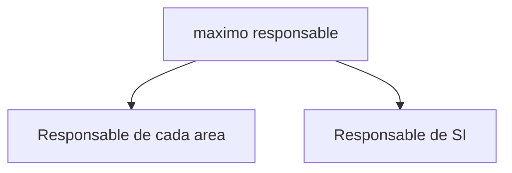
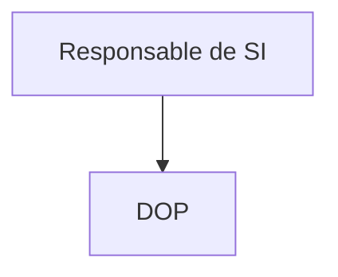
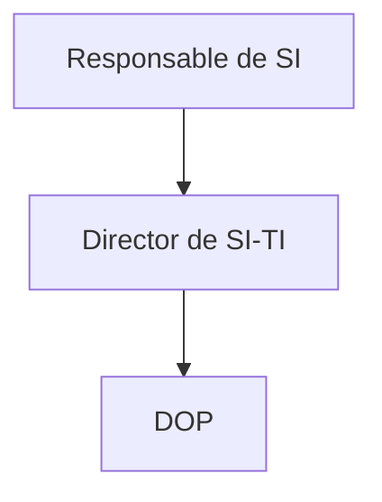
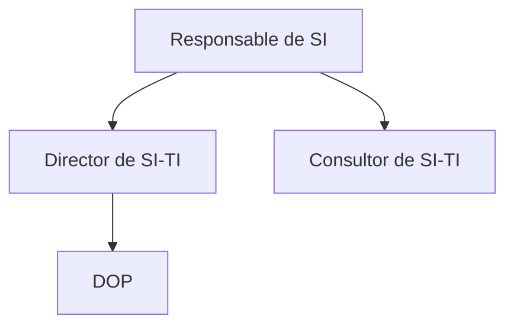
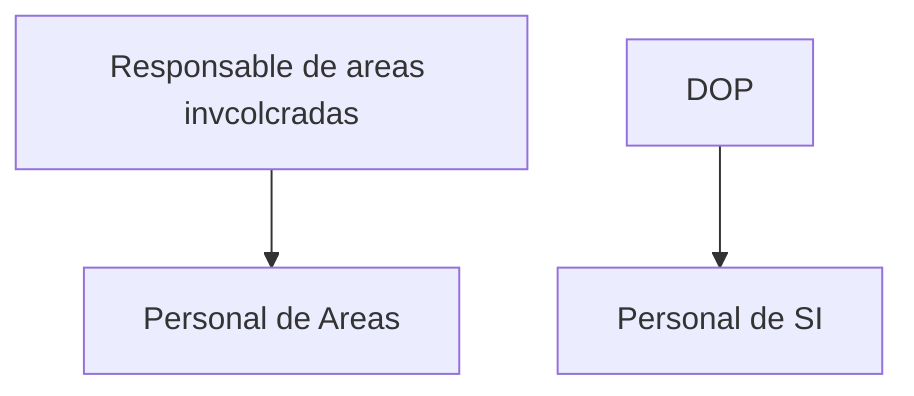

## [[Esquema general del procedimiento de alineacion de las estrategias de SI-TI con las estrategias organizacionales]]

ESTRATEGIA ORGANIZACIONAL -> NECESIDADES DE INFORMACION -> ESTRATEGIA DE SI -> ESTRATEGIA DE TI

## Fase 1 - Presentacion y compromiso del equipo
1. Decision de elaborar un paln de SI-TI.
2. Apoyo total de alta direccion
3. Formacion del ***COMITE DE SI-TI***
 

ellos se encargan de 
- Supervisar
- Priotrizar
- Asignan recursos
- Aprueban

4. Conformacion del ***GRUPO BASE***

En el caso de que el responsable no tenga idea sobre SI-TI, se debe contar con un Director de SI-TI

En caso de que se requiera de un apoyo externo, se debe contar con un Consultor de SI-TI

Donde:
- Lider del proyecto (el que este por arriba del DOP) dirige al DOP

Este grupo:
- Pinesa el plan
- negocia ocn usuarios
- supervisa al equipo

5. Identificar areas y procesos clave
	En la practica cuando se ve un escenario a la hora de identificar las areas es por ejemplo:
	Area de ventas, area de produccion, area de compras, etc.
	Y los procesos clave son los que se consideran mas importantes por cada area. Ejemplo:
	Area de ventas -> Proceso de ventas
	Area de produccion -> Proceso de produccion

6. Conformacion del ***EQUIPO DE TRABAJO***

## Fase 2 - Descripcion de la Situacion actual
1. Identificar Areas y procesos de negocio
2. Describir SI existentes
3. Criticar SI existentes
	1. Den negocio -> soporte adecuado
	2. Tecnico -> Rendimiento
4. Infomre final

## Fase 3 - Elaboracion de plan de SI/TI
1. Agregar Areas detectadas en Fase 2 al equipo
2. Determinar necesidades de Informacion
	- Matriz de necesidades: Funciones/procesos - **Estrategia de SI**
3. Estructura globnal de SI Emergente
	- Director de SI-TI y DOP refinan
	- Comite de SI-TI aprueba
	- Se obtiene **SUBSISTEMAS A  CONSTRUIR + RECURSOS NECESARIOS***

## Fase 4 - Programacion de Actividades

