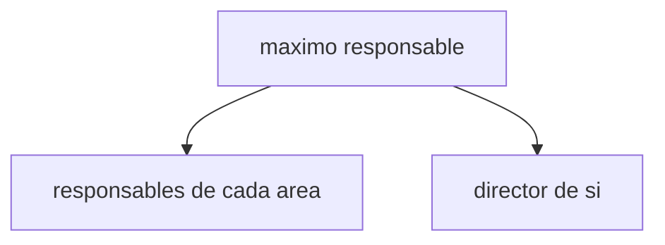
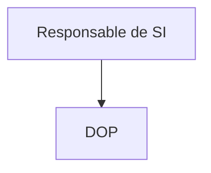
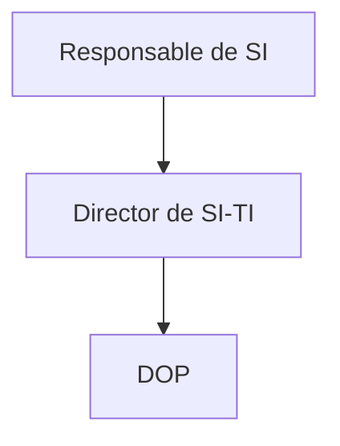

## [[Esquema general del procedimiento de alineacion de las estrategias de SI-TI con las estrategias organizacionales]]

ESTRATEGIA ORGANIZACIONAL -> NECESIDADES DE INFORMACION -> ESTRATEGIA DE SI -> ESTRATEGIA DE TI

## Fase 1 - Presentacion y compromiso del equipo
1. Decision de elaborar un paln de SI-TI.
2. Apoyo total de alta direccion
3. Formacion del Comite de SI-TI
 

ellos se encargan de 
- Supervisar
- Priotrizar
- Asignan recursos
- Aprueban

4. Conformacion del GRUPO BASE

En el caso de que el responsable no tenga idea sobre SI-TI, se debe contar con un Director de SI-TI

## Fase 2 - Descripcion de la Situacion actual

## Fase 3 - Elaboracion de plan de SI/TI

## Fase 4 - Programacion de Actividades

