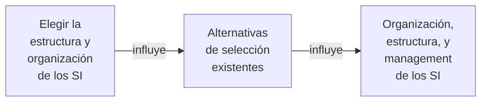
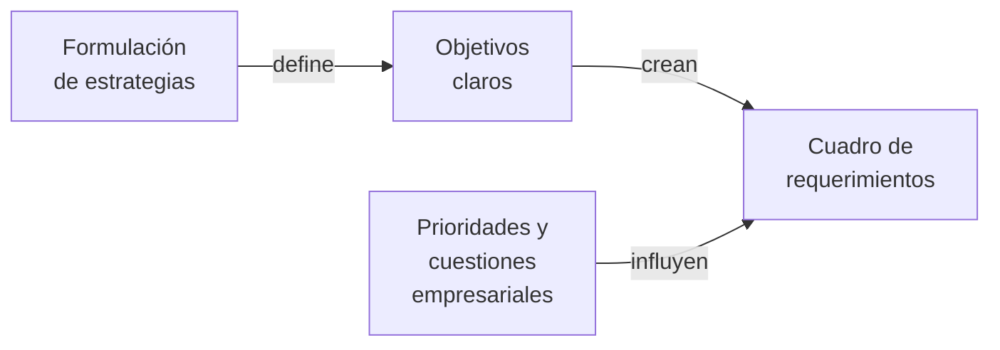

Consiste en la obtención del software y hardware necesario para el sistema informático de la empresa. Es un conjunto de **procedimientos, técnicas de calificación y políticas** para la selección de soluciones de SW y HW más convenientes para la organización según las necesidades especificadas. Busca **abastecer a la organización de los recursos de SI/TI de acuerdo a la arquitectura planeada**.

- Consiste en determinar la **mejor alternativa técnica-operativa-económica** para proveer del SW y HW que requiere la organización.
- Los recursos de SW y HW se seleccionan según **técnicas de calificación y priorización**. Se siguen pautas formales y establecidas por criterio profesional.
- **Determinar las fuentes** es un proceso de toma de decisiones (no un proceso técnico).

## Proceso

![[Proceso de Provisión de SW y HW 2024-05-11 12.24.45.excalidraw.svg]]

Se parte de la **especificación del problema** con las **estrategias y cartera de aplicaciones** definidas gracias a la planificación estratégica de SI/TI. Luego se define el **SW** (si será desarrollo interno o externo) y qué infraestructura de **HW** necesita. Se **evalúan** las **alternativas existentes** con un **puntaje** a partir del cual se define la **selección** para posterior **obtención**.

## Objetivos

1. Investigar e **identificar las alternativas de obtención** de SW y HW concretos, capaces de servir de soporte a la solución recomendada para el SI necesitado. Tiene en cuenta la **cartera de aplicaciones** así como las [[Políticas]] organizacionales y de SI/TI, opiniones técnicas, investigación del mercado de SW y decisiones del comité de SI/TI.
2. Desarrollar, **evaluar y clasificar** las **fuentes de obtención** posibles. Identificar el [[Canal de Obtención de SW]] adecuado teniendo en cuenta las restricciones de la organización.
3. Determinar y **recomendar** las **mejores propuestas** de los posibles proveedores. Se tienen en cuenta **parámetros cuantitativos y cualitativos** usando.
4. Establecer los **requisitos de integración** de los desarrollos y/o productos elegidos. Cómo y de qué forma se van a integrar a sistemas existentes. Elegir un [[Enfoques de Conversión]] para **migrar** de un sistema anterior al nuevo.

## Responsabilidades de Management

Nos permiten sacar el mejor provecho de las inversiones en SI:

- La **gerencia superior** debe **reconocer la ganancia potencial** de toda adquisición. Debe tomar un **rol activo o de apoyo**, y es fundamental en la primera adquisición de un elemento de SI.
- Examinar **relación** entre la empresa y las **estrategias de SI** para verificar que el **método de selección** esté acorde a **términos** de largo plazo y **requerimientos** a corto plazo.
- Evaluar la **implicancia** de todas las aplicaciones en sentido empresarial, técnico y económico.

Las **estrategias de SI se concretan al definir políticas** que guíen la toma de decisiones. El aspecto más directo de cómo implementar una estrategia de SI está dado por las opciones y elecciones hechas al **adquirir SW y HW y seleccionar RRHH**. Elegir es **asignar recursos** de la manera más favorable posible.
![[Provisión de SI y TI 2024-05-09 12.41.59.excalidraw]]

La **administración de recursos** está interesada en la [[Provisión de SI y TI]] por cuestiones como:

- Impacto de los paquetes de SW en el proceso de selección y en la empresa.
- Conceptos de _downsizing_ y _sistemas abiertos_ que forman el paralelo tecnológico del tema empresarial y de la computación controlada por usuario.
- Provisión externa de los elementos de un SI (_outsourcing_).
  $$ElementosDeUnSI = SW + HW + Servicios$$

Dada la complejidad de los SI actuales, no existe un organismo encargado de la [[Selección de SW y HW]] (sector tradicionalmente conocido como "Procesamiento de Datos"), sino que hay una **red de grupos** con relación lógica.

![[Provisión de SI y TI 2024-05-09 12.52.00.excalidraw]]

Siempre se parte desde el **problema empresarial** para **solucionarlo mediante SW y HW**. La jerarquía es: **necesidad empresarial > SW de aplicaciones > SW de sistemas > HW**. No hay que cambiar sin razón, y cuando sí hay que cambiar es mejor hacerlo de manera **simple** y buscando la **flexibilidad**.

Una decisión esencial es determinar el [[Canal de Obtención de SW]] más adecuado. La [[Adquisición de HW]] es más simple ya que siempre se obtiene de una fuente externa.

## Concreción de la Solución Mediante la Fuente Seleccionada

Hay tres posibilidades para adquirir elementos de un SI:

- **Adquisición**: **menores costos** y **rápida disponibilidad** con una calidad conocida y comparable. Requiere adecuar las funcionalidades de los [[Paquetes Estándar]] a los [[Requerimientos de un SI]] de la organización. Es la única posibilidad para la [[Adquisición de HW]].
- **Desarrollo**: el [[Desarrollo Interno de SW]] es apropiado cuando la necesidad empresarial consiste en obtener **ventaja competitiva**. Requiere un **control efectivo** del proyecto de desarrollo, y el mayor costo estará en el proceso de codificación. Ofrece mejor **mantenimiento y especificidad**.
- **Outsourcing**: el [[Outsourcing]] **transfiere a terceros** la responsabilidad de proporcionar un servicio adaptado a nuestras necesidades.

La salida de esta etapa es la **solución definitiva**.

Suponiendo una adquisición fuera de la empresa, se debe elegir una [[Alternativas para el Pago de las Adquisiciones]].
