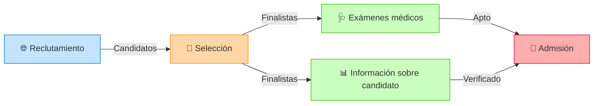
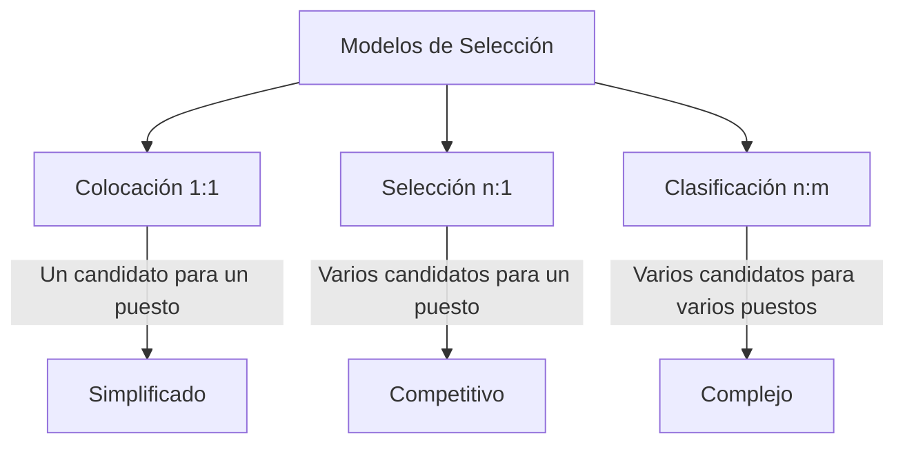

# 🔄 Provisión de Recursos Humanos

***

<div align="center">
  
<h1> 🌟 Gestión Estratégica del Talento 🌟 </h1>
<h3> *De la búsqueda a la incorporación*</h3>

</div>

***

## 📋 Definición y Alcance

La **Provisión de Recursos** es el subsistema conformado por **procesos y técnicas** que suministran los recursos necesarios a la organización. Son los mecanismos que diseñamos y aplicamos para obtener el recurso que nos falta.

> [!NOTE]
> En la simulación experimentamos específicamente la **provisión de recursos humanos**, que son procesos y técnicas que suministran a las personas que se integrarán a la organización.

***

## 🔄 Flujo del Proceso de Provisión

El proceso de provisión tiene cuatro subprocesos principales que funcionan como un sistema integrado:



***

## 📌 Componentes del Sistema

<details>
<summary><b>1️⃣ 🌐 Reclutamiento</b> - Haz clic para expandir</summary>

### Reclutamiento: La puerta de entrada al talento

- **Definición:** Es la obtención de candidatos que puedan ocupar un puesto vacante.
- **Función:** Aplicación de técnicas para atraer candidatos potenciales.

#### 🔍 Proceso de investigación:

| Aspecto | Descripción | Elementos |
|---------|-------------|-----------|
| **Análisis del cargo** | Determinar qué se necesita | Perfil del puesto |
| **Requisitos** | Clasificación por importancia | Excluyentes ⛔ / Preferentes ✅ |
| **Fuentes** | Dónde buscar candidatos | Internas 🏢 / Externas 🌍 |

##### 📊 Tipos de investigación:
- **Investigación Interna** 🏢
  - [x] Base de datos de empleados
  - [x] Planes de carrera existentes
  - [x] Resultados de evaluaciones de desempeño
  
- **Investigación Externa** 🌍
  - [x] Mercado laboral
  - [x] Competencia
  - [x] Universidades y centros de formación

> [!TIP]
> El reclutamiento termina cuando se reciben las postulaciones y se pasan a selección, en ocasiones con un primer filtro ya realizado.

</details>

<details>
<summary><b>2️⃣ 🔄 Selección</b> - Haz clic para expandir</summary>

### Selección: Encontrar el ajuste perfecto

- **Definición:** Proceso de comparación entre la información que brinda el candidato y los requisitos del puesto vacante.
- **Función:** Aplicación de técnicas para comparar candidatos con los requisitos necesarios.

#### 📊 Modelos de selección:



#### 🛠️ Diseño del proceso:
- ¿Cuántas etapas implementar?
- ¿Qué técnicas utilizar?
  - [ ] Entrevistas
  - [ ] Pruebas técnicas
  - [ ] Evaluaciones psicométricas
  - [ ] Assessment center

> [!IMPORTANT]
> La eficacia del proceso de selección determina en gran medida el éxito futuro del candidato en la organización.

</details>

<details>
<summary><b>3️⃣ 🩺 Exámenes Médicos</b> - Haz clic para expandir</summary>

### Exámenes Médicos: Verificación de aptitud física

Evaluación del estado de salud del candidato para determinar su aptitud física para el puesto.

- **Propósito:**
  - Confirmar capacidad física para desempeñar el puesto
  - Detectar condiciones preexistentes
  - Cumplir con requisitos legales y de seguridad

> [!WARNING]
> Los exámenes deben estar relacionados con las funciones del puesto y cumplir con la legislación sobre discriminación y privacidad.

</details>

<details>
<summary><b>4️⃣ 📊 Información sobre el candidato</b> - Haz clic para expandir</summary>

### Información del candidato: Verificación y análisis

Recopilación y análisis de datos relevantes sobre el historial y perfil del candidato.

- **Verificaciones habituales:**
  - Referencias laborales
  - Antecedentes académicos
  - Certificaciones profesionales
  - Historial crediticio (cuando es relevante)
  - Antecedentes legales (cuando es relevante)

```python
# Ejemplo conceptual de verificación
def verificar_candidato(candidato):
    # Verificar referencias
    referencias = obtener_referencias(candidato.id)
    # Verificar credenciales
    credenciales = verificar_credenciales(candidato.educacion)
    # Verificar experiencia
    experiencia = validar_experiencia(candidato.historial_laboral)
    
    return referencias and credenciales and experiencia
```

</details>

<details>
<summary><b>5️⃣ 📝 Admisión</b> - Haz clic para expandir</summary>

### Admisión: La incorporación formal

Es el proceso formal de ingreso del candidato seleccionado a la organización.

- **Componentes:**
  - Formalización del contrato
  - Incorporación a nómina
  - Asignación de recursos (espacio, equipos, accesos)
  - Inducción y onboarding

> [!NOTE]
> La admisión es el puente entre el proceso de selección y la integración efectiva del nuevo colaborador.

</details>

***

## 🧠 Conceptos Clave

### 1. **Ciclo de recursos humanos** ♻️

Los recursos humanos ingresan y egresan de la organización en un flujo continuo:


```
┌──────────────────────────┐       ┌────────────────────┐
│ Mercado de RR.HH.        │◄────► │ Mercado Laboral    │
│ (Candidatos Disponibles) │       │ (Vacantes)         │
└──────────────────────────┘       └────────────────────┘
```

### 2. **Procesos de provisión** 🔄

- **Reclutamiento y Selección** son las fases fundamentales que determinan quién se incorpora a la organización.
 
> *"La calidad de una organización está determinada en gran medida por la calidad de las personas que contrata."*

### 3. **Rotación de personal** 🔃

- **Definición:** Fluctuación de recursos humanos entre una organización y su ambiente.
- **Causas:**
  - Factores externos (mercado laboral, oportunidades)
  - Factores internos (clima laboral, compensación, desarrollo)

### 4. **Ausentismo** ⏱️

- **Definición:** Ausencias del personal en momentos en que debería estar normalmente trabajando.
- **Impacto:** Afecta la productividad, genera costos adicionales y sobrecarga a otros miembros del equipo.

***

## 📊 Indicadores Clave

| Indicador | Descripción | Fórmula |
|-----------|-------------|---------|
| **Tasa de rotación** | Mide el flujo de entradas/salidas | `(Ingresos + Egresos)/2 × 100 / Dotación promedio` |
| **Tasa de ausentismo** | Mide las ausencias del personal | `Horas-hombre perdidas × 100 / Horas-hombre trabajadas` |
| **Costo por contratación** | Costo total por nueva incorporación | `Costos totales de reclutamiento y selección / Número de contrataciones` |
| **Tiempo de cobertura** | Tiempo para cubrir una vacante | `Días transcurridos desde solicitud hasta incorporación` |

***

> [!SUCCESS]
> **Recordatorio:** La efectividad del proceso de provisión determina en gran medida la calidad del capital humano que integrará la organización. Invertir en estos procesos es invertir en el futuro de la empresa.

***

<div align="right">
<i>Última actualización: 20 Agosto 2025</i>
</div>